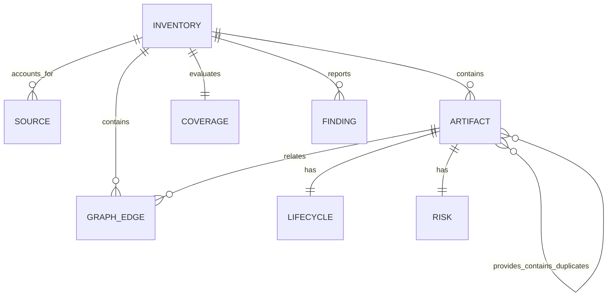

# Capability Intelligence Product Dossier

## Evidence Classification

This dossier uses the following labels throughout:

- **CONFIRMED**: directly supported by repository code, documentation, tests, or observed runtime behaviour.
- **INFERRED**: strongly suggested by the evidence but not explicitly committed as product policy.
- **PLANNED**: described as a future direction without a working implementation.
- **UNKNOWN**: the repository does not provide enough evidence.
- **CONFLICTING**: project sources or observable behaviours disagree.

Reconnaissance was performed on 16 July 2026 against local commit `d79bcc6`. The project root was the only repository investigated. The supplied owner brief was used only for scope and stated design exclusions. No project-local development-chat export was found or inspected.

## 1. Executive Summary

**CONFIRMED:** Capability Intelligence is a standalone, local-first developer tool that inventories agent-related capabilities from an allowlisted set of local metadata sources. It separates discovery, presence, installation, enablement, authentication, runnability, and verification instead of treating those conditions as equivalent. It offers a command-line interface and a loopback-only browser dashboard.

**CONFIRMED:** The product does not execute capabilities, install plugins, authenticate connectors, run autonomous coding workflows, or verify engineering claims. It consumes metadata from systems that do those jobs.

**CONFIRMED:** The current environment scan reconciled 6,353 artifacts from ten available source surfaces with no parse or coverage failures. This includes 734 skills, 180 plugin manifests, 7 installed plugin versions, 250 cached app tools, 4,768 deduplicated connectors, and all 111 plugin manifests that lack standard capability labels. Every artifact remained `verified: unknown` in the observed inventory.

**INFERRED:** The current product maturity is an early working local alpha. Evidence includes version `0.1.0`, a private package, two local commits, no remote configured for this repository, focused automated tests, and no deployment configuration.

**PLANNED:** A future hosted control plane may accept explicitly generated redacted exports and add team catalogues, compatibility intelligence, approved capability sets, drift tracking, and publisher evidence. No hosted service exists in this repository.

### One-Line Description

Capability Intelligence is a local, read-only inventory that explains which agent capabilities are discoverable and what is actually known about their readiness and risk.

### 30-Second Explanation

Agent environments can contain skills, plugins, tools, connectors, hooks, commands, and workflow resources spread across several local systems. Capability Intelligence scans only approved metadata locations, normalises those resources into one inventory, and keeps lifecycle states separate so an installed plugin is not presented as authenticated, runnable, or verified. A technical operator can inspect the result in a CLI or local dashboard, search by intended outcome, review source coverage and risk, compare host availability, and export a redacted report.

### Detailed Explanation For A New Team Member

The application is a dependency-free Node.js process with six source adapters. Each adapter reads a specific metadata surface under an explicitly constructed path, converts each discovered resource into an `artifact`, and reports source accounting. The scanner rejects duplicate artifact identifiers, creates a relationship graph, computes summary counts, and fails strict coverage when source records are lost, parsing fails, unsafe output is found, or manifest counts disagree. The CLI exposes inventory, coverage, search, inspection, diagnostics, risk, duplicate, host-difference, export, and local-server commands. The browser dashboard loads the complete inventory from a loopback JSON endpoint and provides local text, type, and risk filtering plus an evidence detail panel.

## 2. Product Definition

| Attribute | Finding | Classification | Evidence |
|---|---|---|---|
| Product name | Capability Intelligence | CONFIRMED | `package.json`, `README.md`, `static/index.html` |
| Alternate names | CLI alias `capability`; no previous product name found | CONFIRMED / UNKNOWN | `package.json`; two-commit history |
| Category | Local developer tool; capability inventory and readiness intelligence | CONFIRMED | `README.md`, `docs/product-contract.md` |
| Primary problem | Agent capabilities are scattered across sources and metadata does not prove operational readiness | CONFIRMED | README questions; product truth rules |
| Value | One deterministic inventory with evidence, lifecycle, risk, source accounting, duplicates, and host differences | CONFIRMED | `src/scanner.js`, `src/graph.js`, `src/query.js` |
| Intended environment | Local workstation with Node.js 20 or later | CONFIRMED | `package.json`, loopback server, default home paths |
| Distribution | Private npm-compatible package with two executable names; not published here | CONFIRMED | `package.json` (`private: true`), git state |
| Commercial model | Unknown | UNKNOWN | No pricing, billing, licence, or commercial policy |
| Open-source status | Unknown | UNKNOWN | No licence file or remote repository |
| Primary interface | CLI and local dashboard | CONFIRMED | `src/cli.js`, `src/server.js`, `static/` |
| Distinguishing characteristic | Lifecycle and evidence states remain separate and unknowns remain visible | CONFIRMED | `docs/product-contract.md`, `src/model.js` |

### Explicitly Outside Scope

**CONFIRMED:** The current contract excludes being a skill registry, package manager, MCP gateway, autonomous workflow engine, or evidence verifier. It does not install, enable, authenticate, invoke, update, or remove capabilities. It does not crawl arbitrary home-directory content or make network requests during a default scan.

## 3. Product Maturity And Status

### Working Now

- **CONFIRMED:** Deterministic local inventory from ten source surfaces.
- **CONFIRMED:** Human-readable and JSON CLI output.
- **CONFIRMED:** Strict source reconciliation and unsafe-output checks.
- **CONFIRMED:** Outcome search, artifact inspection, risk listing, duplicate detection, and host difference.
- **CONFIRMED:** Redacted JSON export with mode `0600` for newly created files.
- **CONFIRMED:** Loopback dashboard and read-only HTTP API.
- **CONFIRMED:** Responsive checks at 320x800 and 1440x900.

### Working With Limitations

- **CONFIRMED:** Outcome search ranks by readiness even when no query term matches, so unrelated or empty queries return up to 20 results.
- **CONFIRMED:** The dashboard downloads the full 6.5 MB observed inventory while rendering at most 500 rows.
- **CONFIRMED:** Dashboard filtering and CLI/API outcome search use different algorithms.
- **CONFIRMED:** Risk and capability classifications depend on metadata quality and conservative string inference.
- **CONFIRMED:** The inventory schema declares required top-level fields but does not validate detailed artifact and source shapes.

### Planned Only

- **PLANNED:** Hosted control plane and team catalogues.
- **PLANNED:** Compatibility intelligence, approved sets, drift tracking, and publisher evidence profiles.
- **PLANNED:** Additional sources such as skills.sh, Agent Package Manager, and the official MCP Registry.
- **PLANNED:** Observed execution receipts as the only route to `verified: yes`.

### Absent

- **CONFIRMED:** Accounts, authentication, authorisation roles, organisations, subscriptions, payments, notifications, analytics, database, file upload, cloud sync, background jobs, and product-admin screens.
- **CONFIRMED:** Capability execution or mutation.

## 4. Users And Jobs-To-Be-Done

No demographic personas are supported by the repository. The following functional roles are evidence-based.

### Local Technical Operator

| Attribute | Finding | Classification |
|---|---|---|
| Context | Works on a workstation containing Codex, agent skill roots, and possibly the workflow library | CONFIRMED |
| Technical knowledge | Comfortable with a terminal, local files, plugins, tools, and lifecycle terminology | INFERRED |
| Primary objective | Understand what capabilities exist and what readiness evidence is actually available | CONFIRMED |
| Recurring tasks | Scan, search, inspect, review risk, diagnose coverage, compare hosts | CONFIRMED |
| Pain points | Fragmented capability sources; misleading equivalence between installed and usable | CONFIRMED |
| Concerns | Privacy, secret exposure, destructive authority, false readiness claims | CONFIRMED |
| Device | Desktop workstation; mobile is supported for inspection but not established as primary | INFERRED |
| Permissions | Operating-system read access to allowlisted metadata and write access to a chosen export path | CONFIRMED |
| Success | Can identify relevant resources while seeing unknowns, risks, and source gaps | CONFIRMED |
| Irreversible actions | None against capability sources; export may overwrite a chosen local file | CONFIRMED |

### Capability Maintainer Or Integrator

| Attribute | Finding | Classification |
|---|---|---|
| Context | Maintains skills, plugins, connector metadata, or workflow resources | INFERRED |
| Objective | Detect duplicates, host drift, metadata gaps, and incorrect source accounting | CONFIRMED |
| Recurring tasks | Strict scan, coverage, doctor, duplicates, host diff, JSON export | CONFIRMED |
| Information needed | Source records, represented counts, parse failures, artifact IDs and relationships | CONFIRMED |
| Success | No silent source loss and actionable metadata gaps remain visible | CONFIRMED |

### Future Team Catalogue User

**PLANNED:** The SaaS architecture implies a team-level user who reviews private catalogues, approved capability sets, and configuration drift. No role, permission, screen, API, or data model exists for this user.

### Ranked Jobs-To-Be-Done

| Rank | Job |
|---|---|
| Primary | When an agent environment contains many distributed resources, the user wants to inventory them from one place so they can understand what is discoverable without assuming it works. |
| Primary | When the user needs to achieve an outcome, they want to find plausible capabilities and inspect readiness and risk so they can choose the next tool deliberately. |
| Primary | When a scan completes, the user wants source reconciliation and unknown states so they can distinguish complete inventory coverage from operational verification. |
| Secondary | When multiple hosts or skill roots may overlap, the user wants duplicate and host-difference views so they can identify drift and redundant resources. |
| Secondary | When another person needs the inventory, the user wants a redacted export so they can share metadata without local paths or private descriptions. |
| Occasional | When visual exploration is preferable to CLI output, the user wants a loopback dashboard so they can filter and inspect artifacts. |
| Administrative | None implemented. |

## 5. Feature Inventory

| Feature | User | User value | Entry point | Current status | Main files | API/data dependency | Permissions | Known limitations |
|---|---|---|---|---|---|---|---|---|
| Environment scan | Operator | Unified inventory | `scan` | Working | `src/scanner.js`, adapters | Allowlisted local metadata | Local read | Metadata only; no runtime proof |
| Strict coverage | Maintainer | Detects silent loss and unsafe output | `scan --strict`, `coverage` | Working | `src/scanner.js` | Source accounting | Local read | Schema is only partially constrained |
| Outcome search | Operator | Finds plausible capabilities | `ask`, `/api/search` | Working with limitations | `src/classify.js`, `src/query.js` | In-memory inventory | Local read | Returns readiness-ranked items without lexical matches |
| Artifact inspection | Operator | Shows lifecycle, risk, source, relationships | `inspect`; dashboard row | Working with limitations | `src/query.js`, `static/app.js` | Inventory and graph | Local read | Dashboard omits graph relationships and metadata |
| Doctor | Maintainer | Summarises source and finding health | `doctor` | Working | `src/cli.js` | Sources, findings, coverage | Local read | No remediation guidance |
| Risk listing | Operator | Lists metadata-derived risk | `risks` | Working with limitations | `src/model.js`, `src/cli.js` | Artifact risk | Local read | Unknown levels accepted; risk is not runtime-tested |
| Duplicate skills | Maintainer | Finds same-name skills | `duplicates` | Working | `src/graph.js` | Skill names | Local read | Name-based only; no semantic/version comparison |
| Host difference | Maintainer | Shows name presence differences | `diff --host` | Working with limitations | `src/query.js` | Artifact host labels | Local read | Name/type comparison only; arbitrary host strings accepted |
| Redacted export | Operator | Shareable local report | `export --redacted` | Working with limitations | `src/scanner.js`, `src/cli.js` | Full scan | Local file write | Overwrites path; existing file mode is not re-hardened |
| Local dashboard | Operator | Visual browse/filter/detail | `serve`, `/` | Working with limitations | `src/server.js`, `static/` | `/api/inventory` | Loopback access | Full 6.5 MB payload; 500-row cap; no pagination |
| Read-only HTTP API | Local integrator | Machine-readable inventory | `/health`, `/api/*` | Working | `src/server.js` | Cached startup inventory | Loopback access | No rescan endpoint; no API versioning |
| Hosted team plane | Future team user | Team catalogues and drift | None | Planned | `docs/saas-architecture.md` | Not implemented | Unknown | No code, model, roles, or deployment |

### Feature Inputs, Outputs, And Side Effects

- **Scan inputs:** optional home path; existing allowlisted files. **Outputs:** inventory object or rendered text. **Side effects:** none.
- **Search inputs:** free-text outcome. **Outputs:** at most 20 scored artifacts. **Side effects:** none.
- **Inspect inputs:** exact artifact ID. **Outputs:** artifact plus incoming and outgoing edges. **Failure:** exit 2 when absent.
- **Risk inputs:** optional unvalidated level. **Outputs:** matching artifacts or a no-record message.
- **Host diff inputs:** exactly two host strings. **Outputs:** name/type presence differences.
- **Export inputs:** output path and optional redaction. **Outputs:** JSON file. **Side effect:** local file creation or overwrite.
- **Serve inputs:** port 0-65535 and optional home. **Outputs:** long-running loopback process and HTTP responses.

## 6. Workflow Documentation

### Workflow: Build A Complete Inventory

**User:** Local technical operator
**Trigger:** The user wants current capability visibility.
**Objective:** Produce a deterministic, source-accounted inventory.
**Preconditions:** Node.js 20+ and readable allowlisted source roots.
**Starting location:** Project directory or installed CLI.
**Required information:** Optional alternate home path.
**Primary path:**

1. Run `capability-intelligence scan` or `scan --strict --summary`.
2. The scanner constructs fixed source paths.
3. Six adapters normalise records into artifacts and sources.
4. Duplicate artifact IDs are rejected.
5. A relationship graph, summary, findings, and coverage result are generated.
6. Human or JSON output is returned.

**Decision points:** Use JSON, summary, or strict failure semantics.
**Validation:** Source accounting, parse failures, unsafe values, duplicate IDs, marketplace count, and unlabelled-manifest count.
**Success result:** Exit 0 with `coverage: passed`.
**Failure conditions:** Adapter failure, parse failure, unaccounted record, unsafe output, or mismatch.
**Recovery:** Inspect `coverage` or `doctor`; no automated remediation.
**Permissions:** Read-only access to allowlisted metadata.
**Relevant files:** `src/scanner.js`, `src/adapters/*.js`.
**Status:** Working.

### Workflow: Find A Capability For An Outcome

**User:** Operator
**Trigger:** A task such as creating a product video.
**Objective:** Find plausible artifacts and understand readiness/risk.
**Preconditions:** A successful inventory exists.
**Starting location:** `ask` CLI or dashboard search.
**Required information:** A free-text outcome or capability phrase.
**Primary path:** Enter an outcome; review ranked or filtered results; inspect a result.
**Decision points:** CLI/API use scored concept matching; dashboard uses AND substring filtering.
**Alternative paths:** Add type/risk filters in the dashboard; browse the inventory without text; inspect an exact known ID.
**Validation:** CLI requires non-empty positional text; dashboard accepts empty input.
**Success result:** Matching artifacts with lifecycle and risk.
**Failure conditions:** **CONFLICTING:** CLI/API never reach a true no-match state in a populated inventory because readiness adds positive score without a term match.
**Recovery:** Manually refine dashboard filters or inspect result relevance.
**Notifications or feedback:** CLI prints score, readiness, risk, and matched terms; dashboard updates the row count immediately.
**Permissions:** Local read only.
**Relevant routes/APIs:** Dashboard `/`; API `/api/search?q=`.
**Relevant files:** `src/classify.js`, `src/query.js`, `src/render.js`, `static/app.js`.
**Status:** Working with limitations.
**Open questions:** Which search contract should be canonical, and what should a genuine no-match response contain?

### Workflow: Inspect Evidence And Lifecycle

**User:** Operator
**Trigger:** A candidate artifact needs closer review.
**Objective:** Separate what is present from what is operationally known.
**Preconditions:** An inventory exists and the user has an artifact ID or visible row.
**Starting location:** CLI result/inventory or dashboard table.
**Required information:** Exact artifact ID for CLI; selected row for dashboard.
**Primary path:** Use `inspect <artifact-id>` or activate a dashboard table row.
**Decision points:** Decide whether condensed readiness is sufficient or the full lifecycle needs review.
**Alternative paths:** Inspect JSON output or use CLI for relationship counts omitted by the dashboard.
**Validation:** CLI checks exact ID existence; dashboard choices come from loaded data.
**Success result:** Name, type, source, capability labels, evidence level, risk, lifecycle; CLI also reports relationship counts.
**Failure:** CLI exit 2 for unknown ID. Dashboard has no missing-ID state because rows come from loaded inventory.
**Recovery:** Return to search/inventory and choose an existing artifact; no closest-match helper exists.
**Notifications or feedback:** Dashboard highlights the selected row and replaces detail content.
**Permissions:** Local read only.
**Relevant routes/APIs:** Dashboard `/`; artifact inspection has no dedicated HTTP endpoint.
**Relevant files:** `src/query.js#inspectArtifact`, `src/cli.js`, `static/app.js#selectArtifact`.
**Mobile limitation:** Detail content follows the inventory table in DOM order and may be hundreds of rows below the selected item.
**Status:** Working with limitations.
**Open questions:** Whether graph edges and metadata should be visible, and how detail should work on mobile.

### Workflow: Diagnose Coverage

**User:** Maintainer
**Trigger:** A scan fails or source completeness must be proven.
**Objective:** Identify absent, failed, incomplete, or unsafe source accounting.
**Preconditions:** Read access to configured roots.
**Starting location:** CLI.
**Required information:** Optional alternate home path.
**Primary path:** Run `coverage` and `doctor`; review source status, records, represented, deduplicated, parse failures, and findings.
**Decision points:** Distinguish absent source from adapter failure; decide whether strict failure blocks downstream use.
**Alternative paths:** Use `scan --strict --summary` or JSON output.
**Validation:** Coverage rules recompute source accounting and unsafe output.
**Success:** All available source records are accounted for and no unsafe output is found.
**Failure:** Non-zero exit when coverage fails.
**Recovery:** Repair the source or adapter outside this product, then rescan.
**Notifications or feedback:** Human output names failed source/code without dumping private source contents.
**Permissions:** Local read only.
**Relevant routes/APIs:** `/health` and `/api/coverage` expose bounded status; dashboard source ledger exposes accounting.
**Relevant files:** `src/scanner.js#evaluateCoverage`, `src/cli.js#renderCoverage`, adapters.
**Status:** Working.
**Open questions:** Which warnings should block strict mode and what recovery guidance can be safely shown?

### Workflow: Review Risk

**User:** Operator
**Trigger:** A capability may write, destroy, reach open-world systems, or run automatically.
**Objective:** Understand metadata-derived caution before selecting a capability.
**Preconditions:** A completed inventory with risk records.
**Starting location:** CLI risk list or dashboard filter/detail.
**Required information:** Optional risk level or selected artifact.
**Primary path:** Run `risks --level <level>` or filter the dashboard by risk; select an artifact for reasons.
**Decision points:** Separate unknown risk from low risk and metadata hints from observed authority.
**Alternative paths:** Inspect one artifact or consume JSON.
**Validation:** None for the level string.
**Success:** Metadata-derived level and reasons are displayed.
**Failure conditions:** An invalid level is treated as a valid empty result; no runtime permission evidence is available.
**Recovery:** Use one of the five documented levels and inspect reasons.
**Notifications or feedback:** CLI lists records; dashboard shows a badge and reasons in detail.
**Permissions:** Local read only.
**Relevant routes/APIs:** Dashboard `/`; risk has no dedicated endpoint.
**Relevant files:** `src/model.js`, `src/cli.js#renderRisks`, `static/app.js`.
**Limitation:** Risk is not permission inspection or execution evidence.
**Status:** Working with limitations.
**Open questions:** Whether risk requires confidence/evidence labels and which levels are public commitments.

### Workflow: Find Duplicate Skills

**User:** Maintainer
**Trigger:** Multiple roots or plugins may contain the same skill name.
**Objective:** Identify duplicate skill identities for review.
**Preconditions:** Inventory graph built from at least one skill source.
**Starting location:** CLI.
**Required information:** None.
**Primary path:** Run `duplicates`.
**Decision points:** Decide whether same-name records are intentional host copies or maintenance drift.
**Alternative paths:** Inspect IDs individually or use JSON output.
**Validation:** Groups require at least two lowercased equal skill names.
**Success:** Same-name skill artifact IDs are grouped; observed inventory contained 54 groups.
**Failure conditions:** None; empty groups produce a success message.
**Recovery:** Not applicable; remediation occurs in source repositories, not this product.
**Notifications or feedback:** `No duplicate skill names detected.` when empty.
**Permissions:** Local read only.
**Relevant routes/APIs:** CLI only.
**Relevant files:** `src/graph.js`, `src/cli.js#renderDuplicates`.
**Limitation:** Similar-but-differently-named resources and version compatibility are not assessed.
**Status:** Working.
**Open questions:** Whether duplicate analysis should account for version, content, aliases, or intentional host copies.

### Workflow: Compare Hosts

**User:** Maintainer
**Trigger:** A capability may exist in Codex but not Claude or another host label.
**Objective:** Identify type/name presence differences between two host labels.
**Preconditions:** Inventory artifacts contain host labels.
**Starting location:** CLI.
**Required information:** Exactly two `--host` values.
**Primary path:** Run `diff --host <left> --host <right>`.
**Decision points:** Decide whether a difference is intentional or a distribution gap.
**Alternative paths:** Use JSON output or inspect each artifact.
**Validation:** Exactly two values are required.
**Success:** Type/name records present on only one side are listed.
**Failure conditions:** Missing/extra host options fail; unknown host names yield a valid comparison with no explicit warning.
**Recovery:** Supply two known host labels.
**Notifications or feedback:** Empty comparison produces `No capability-name differences...`.
**Permissions:** Local read only.
**Relevant routes/APIs:** CLI only.
**Relevant files:** `src/query.js#hostDiff`, `src/cli.js#renderDiff`.
**Limitation:** Host names are not validated and configuration differences are not compared.
**Status:** Working with limitations.
**Open questions:** Approved host vocabulary and whether configuration/version comparison belongs in scope.

### Workflow: Export A Redacted Report

**User:** Operator or maintainer
**Trigger:** Inventory needs to be shared or consumed elsewhere.
**Objective:** Create a machine-readable report with selected private metadata withheld.
**Preconditions:** Writable output location.
**Starting location:** CLI.
**Required information:** Output path; optional `--redacted`.
**Primary path:** Run `export --output <path> --redacted`.
**Decision points:** Redacted versus full inventory; whether downstream use is appropriate.
**Alternative paths:** Use `scan --json` without writing a file.
**Validation:** Output is rescanned for unsafe keys/values; observed export passed and excluded the home path.
**Success:** JSON is written; a newly created file had mode `0600`.
**Failure:** Missing path, filesystem error, or failed coverage.
**Recovery:** Choose a writable path, correct coverage failures, or use stdout JSON.
**Notifications or feedback:** CLI reports the written path and redaction mode.
**Permissions:** Local read plus write at the chosen destination.
**Relevant routes/APIs:** CLI only; no upload endpoint.
**Relevant files:** `src/cli.js`, `src/scanner.js#redactedInventory`.
**Side effect:** Creates or replaces a local file.
**Open question:** Whether overwrite confirmation or existing-mode hardening is required.
**Status:** Working with limitations.

### Workflow: Browse The Dashboard

**User:** Operator
**Trigger:** Visual exploration is preferred.
**Objective:** Browse, filter, and inspect the startup inventory in a browser.
**Preconditions:** The loopback server is running and the browser can reach it.
**Starting location:** CLI `serve`, then `/`.
**Required information:** Optional port and home path; optional search/type/risk filters.
**Primary path:** Run `serve`; open the loopback URL; wait for inventory; filter by text/type/risk; activate a row; read detail and source ledger.
**Decision points:** Narrow the 500-row display; decide whether full lifecycle detail is needed.
**Alternative paths:** Use CLI commands or JSON API for complete/diagnostic views.
**Validation:** Port range is validated; UI controls themselves accept any text and generated/fixed options.
**Loading:** `Scanning inventory` until the API returns.
**Error:** `Inventory unavailable` with no cause or retry.
**Success:** Coverage, metrics, up to 500 rows, detail, and source accounting are visible.
**Recovery:** Restart the server or refresh manually; no in-product retry exists.
**Notifications or feedback:** Live coverage status, result count, selected-row highlight, and detail replacement.
**Permissions:** Local read and loopback access.
**Relevant routes/APIs:** `/`, `/api/inventory`, `/api/coverage`, `/health`.
**Relevant files:** `src/server.js`, `static/index.html`, `static/app.js`, `static/styles.css`.
**Status:** Working with limitations.
**Open questions:** Whether the browser should expose rescan, duplicates, host diff, findings, graph, and export.

## 7. Information Architecture

### Current Hierarchy

```text
Capability Intelligence
|- CLI
|  |- inventory and coverage
|  |- outcome search and inspection
|  |- diagnostics and comparison
|  `- export and local server
`- Loopback dashboard (/)
   |- coverage status
   |- text/type/risk filters
   |- summary metrics
   |- capability inventory table
   |- selected artifact detail
   `- source coverage ledger
```

There are no authenticated, administrator, settings, nested, or dynamic browser routes.

### Route And Screen Inventory

| Route | Screen name | Intended user | Purpose | Primary action | Main information | Data source | Current state | Evidence |
|---|---|---|---|---|---|---|---|---|
| `/` | Capability inventory dashboard | Local operator | Browse and inspect inventory | Filter/select artifact | Coverage, metrics, table, detail, sources | `/api/inventory` | Working with limitations | `static/index.html`, browser audit |
| `/health` | API only | Local integrator | Process and coverage health | GET | `status`, `coverage` | Startup inventory | Working | `src/server.js` |
| `/api/inventory` | API only | Dashboard/integrator | Full normalized inventory | GET | All artifacts, graph, findings | Startup scan | Working | handler test/runtime |
| `/api/coverage` | API only | Integrator | Coverage result | GET | Status, failures, counts | Startup inventory | Working | handler test/runtime |
| `/api/search?q=` | API only | Integrator | Scored outcome search | GET | Up to 20 results | Startup inventory | Working with limitations | `src/query.js`, runtime |
| `/styles.css` | Static asset | Browser | Dashboard styling | GET | CSS | Repository file | Working | runtime 200 |
| `/app.js` | Static asset | Browser | Dashboard interaction | GET | JavaScript | Repository file | Working | runtime 200 |
| Any missing path | JSON error | Local caller | Not-found feedback | GET | `not_found` | None | Working | runtime 404 |
| Any non-GET method | JSON error | Local caller | Reject mutations | Non-GET | `method_not_allowed` | None | Working | runtime 405 |

### Dashboard Screen States

- **Loading:** Coverage text says `Scanning inventory`; other regions retain initial loading/select copy.
- **Success:** Coverage status, five metrics, rows, details, and source ledger.
- **Filtered empty:** Table can become empty through type/risk/text combinations, but no dedicated message is rendered.
- **Error:** Coverage text changes to `Inventory unavailable`; no retry, error cause, or offline guidance.
- **Selection:** Selected row receives a visual class and detail content changes.
- **Permission restricted:** Not applicable; there is no role model.

## 8. Domain Model

### Entity Summary

| Entity | Definition | Important fields | Lifecycle / ownership | UI/API use |
|---|---|---|---|---|
| Inventory | One point-in-time normalized scan | schemaVersion, generatedAt, mode, summary, sources, artifacts, graph, findings, coverage | Created in memory per CLI command or server startup; no persistence | Full API and CLI output |
| Source | Accounting record for an adapter surface | id, status, records, represented, deduplicated, parseFailures, metadata | Derived from local source; immutable within inventory | Coverage ledger, doctor |
| Artifact | One capability-related resource | id, type, name, description, source, hosts, capabilities, evidence, lifecycle, risk, metadata | Owned by source adapter; no update/delete API | Table, detail, CLI |
| Lifecycle | Separate readiness assertions | discovered, present, installed, enabled, authenticated, runnable, verified | Values are `yes`, `no`, `unknown`, or `not_applicable` by convention | Readiness badge and detail |
| Risk | Metadata-derived operational caution | level, reasons | Computed during scan | Risk filter/list/detail |
| Coverage | Source completeness result | status, failures, unlabelledManifests, sourceCount, artifactCount | Computed after scan and redaction | Header, health, strict exit |
| Finding | Adapter or normalization warning/error | level, code, source, message | Derived during scan | Doctor; not shown in dashboard |
| Graph edge | Relationship between artifacts | from, to, type | Derived from provider structures and duplicate names | CLI inspect counts; absent from dashboard |
| Duplicate group | Same-name skill group | name, artifactIds | Derived from skill names | CLI duplicates |
| Search result | Ranked artifact response | artifact, score, matched | Computed per query | CLI/API; not dashboard filtering |

### Artifact Types

**CONFIRMED:** `agent`, `app-integration`, `app-tool`, `command`, `connector`, `documentation-control`, `helper-script`, `hook`, `mcp-server`, `plugin`, `plugin-installation`, `resource-provider`, `schema`, `skill`, `template`, `ui`, `workflow`, and `workflow-route` were observed. `docs/product-contract.md` has an older shorter list and omits several types added later.

### Entity Relationships

- A source accounts for zero or more artifacts.
- A plugin may provide app integrations or MCP servers and contain skills or components.
- A catalogue plugin may have one or more installed-version artifacts through `installed-as` edges.
- The workflow-library provider provides skills, commands, scripts, schemas, templates, documentation, and routes.
- Same-name skills are connected by `duplicates` edges.



There is no database model, migration, user ownership, update operation, deletion operation, or archival lifecycle.

## 9. Business Rules

| Rule | Applies to | User impact | Evidence | Confidence |
|---|---|---|---|---|
| Default scan uses constructed allowlisted paths | Scan | Prevents arbitrary home crawling | `defaultConfig`, adapters | CONFIRMED |
| Excluded path segments are never walked | File discovery | Avoids sessions, logs, credentials, `.env`, and similar state | `src/utils.js` | CONFIRMED |
| Discovery does not imply later lifecycle states | All artifacts | Prevents false readiness | product contract, model | CONFIRMED |
| Only observed evidence may set verified yes | Verification | No current artifact is verified | product contract; observed inventory | CONFIRMED / PLANNED receipt source |
| Missing roots are `absent`; thrown adapters are `failed` | Coverage | Distinguishes unavailable source from failure | `src/scanner.js` | CONFIRMED |
| Available source records must equal represented + deduplicated + parse failures | Strict coverage | Silent loss fails coverage | `evaluateCoverage` | CONFIRMED |
| Duplicate artifact IDs are rejected and become errors | Normalization | Prevents overwrite | `scanEnvironment` | CONFIRMED |
| Unlabelled plugin manifests remain represented and counted | Plugin inventory | Metadata gaps remain visible | product contract, scanner | CONFIRMED |
| Forbidden keys and unsafe string patterns fail coverage | Output safety | Reduces secret/path leakage | `findUnsafeOutput` | CONFIRMED |
| App-tool risk follows read-only, destructive, and open-world annotations | Risk | Critical/high/medium/low labels are metadata-derived | `toolRisk` | CONFIRMED |
| Hooks are high risk; executable integrations are medium by default | Components | Shows caution without runtime proof | `componentRisk` | CONFIRMED |
| Search returns at most 20 results | CLI/API search | Result set is bounded | `searchArtifacts` | CONFIRMED |
| Search readiness points do not require a term match | CLI/API search | No-match state is not reliable | `matchOutcome`, runtime probe | CONFIRMED defect |
| Dashboard text filter requires every term as a substring | Dashboard | Narrower than API search | `static/app.js` | CONFIRMED |
| Dashboard displays at most 500 artifacts | Dashboard | Remaining items require filtering | `applyFilters` | CONFIRMED |
| Readiness label is the highest state with `yes` | CLI/dashboard | Condenses lifecycle to one badge | render functions | CONFIRMED |
| Server binds only to `127.0.0.1` | HTTP | Limits network exposure | `startServer` | CONFIRMED |
| HTTP API accepts GET only | HTTP | No HTTP mutation routes | request handler | CONFIRMED |
| Server inventory is scanned once at startup | Dashboard/API | Source changes require restart | `startServer` | CONFIRMED |
| New export file requests mode `0600` | Export | Restricts default file access | `src/cli.js`, runtime stat | CONFIRMED |
| Port must be an integer 0-65535 | Serve | Invalid values fail before bind | `parsePort` | CONFIRMED |
| Unknown CLI options are accepted and ignored by commands | CLI | Typos can look successful | `parseArgs`, runtime probe | CONFIRMED defect |

## 10. Product-State Catalog

| Feature or screen | State | Trigger | Existing handling | Required information | Missing handling |
|---|---|---|---|---|---|
| Dashboard | Initial loading | Page open | `Scanning inventory`, `Loading`, selection prompt | Inventory request state | Skeleton, progress, timing |
| Dashboard | Success | Inventory API resolves | Metrics/table/sources rendered | Full inventory | None essential |
| Dashboard | Server/network error | Fetch rejects/non-2xx | `Inventory unavailable` | Failure occurred | Cause, retry, support guidance |
| Dashboard | Filtered empty | Filters remove all rows | `0 shown`, empty table | Active filters | Dedicated explanation/reset action |
| Dashboard | Partial display | More than 500 matches | `500+ shown` | Total matching count | Exact count, pagination/virtualisation |
| Dashboard | Selected | Row click/Enter/Space | Row highlight and detail update | Artifact | `aria-selected`, detail announcement |
| Dashboard | Mobile selection | Row selection below 980px | Detail updates after inventory section | Artifact | Proximate detail or navigation |
| Scan | Completed/pass | All coverage rules pass | Exit 0 and passed result | Counts | None |
| Scan | Failed | Parsing/accounting/safety error | Non-zero only with strict/coverage/doctor | Failure list | Guided recovery |
| Source | Absent | Root missing | Source status absent | Source ID | User explanation in dashboard |
| Source | Failed | Adapter throws | Generic safe failure | Adapter name | Root cause intentionally withheld |
| Search | Results | Any non-empty or even unrelated query | Up to 20 results | Query, score | Reliable no-match state |
| Search | Empty query | API call without q | Returns readiness-ranked results | None | Input validation |
| Inspect | Not found | Unknown ID | CLI error and exit 2 | Artifact ID | Suggestions/closest match |
| Risk | No records | No artifacts at level | Text message, exit 0 | Level | Level validation |
| Export | Success | File written | Path message, exit by coverage | Output path | Overwrite confirmation |
| Export | Filesystem error | Invalid/unwritable path | Top-level error | Error message | Recovery guidance |
| HTTP | Not found | Unknown route | 404 JSON | Error code | None |
| HTTP | Method not allowed | Non-GET | 405 JSON | Error code | `Allow` header |
| Offline | Server not running | Browser cannot connect | Browser-level failure | None | Product-specific offline page |
| Unauthorized/forbidden/session | Any | Not applicable | Not implemented | None | No auth model exists |
| Processing/queued/cancelled/archived | Any | Not applicable | Not implemented | None | Outside current model |
| Destructive confirmation | Export overwrite | Existing output path | No confirmation | Path existence | Confirmation or explicit force policy |

## 11. Roles And Permissions

**CONFIRMED:** There is no application identity, role, session, authentication, or authorisation model. The effective user is the local operating-system user. Filesystem permissions govern source reads and exports. The loopback server has no application authentication but is not bound to external interfaces.

**PLANNED/UNKNOWN:** Future hosted-team roles are not defined. Lovable or another implementation agent must not invent owner, admin, member, billing, or guest roles.

## 12. Integrations

### Implemented Read-Only Sources

1. Codex plugin catalogue and marketplace index.
2. Installed Codex plugin cache.
3. Codex user skills.
4. Shared `.agents` skills.
5. Claude skills.
6. Cached Codex app-tool definitions and safety annotations.
7. Cached Codex app-directory connectors.
8. Autonomous coding workflow library resources.

These are local metadata integrations, not authenticated live API connections.

### Planned Sources

**PLANNED:** skills.sh metadata, Agent Package Manager manifests/lockfiles, official MCP Registry, and tool schemas exposed by supported hosts.

## 13. Technical Architecture

| Concern | Current implementation |
|---|---|
| Language | JavaScript ES modules |
| Runtime | Node.js >=20 |
| Package manager | npm with lockfile |
| Runtime dependencies | None |
| Frontend | Static HTML, CSS, browser JavaScript |
| Build system | None; files are served directly |
| Routing | Single static page plus manual Node HTTP paths |
| Styling | Hand-authored CSS; dark colour scheme |
| Components | DOM functions, no component framework |
| State management | Module-level `inventory` and `visible` arrays |
| Data fetching | Browser `fetch('/api/inventory')` |
| Forms | Native search/select controls |
| Validation | Manual CLI parsing and scanner rules |
| Backend | Node `http` server and synchronous filesystem adapters |
| API style | Read-only JSON over loopback HTTP |
| Persistence | None; in-memory inventory plus optional JSON export |
| Authentication | None |
| Database/storage | None; local filesystem reads and chosen export file |
| Third-party services | None called by default scan or server |
| Analytics/notifications | None |
| Deployment | None documented or configured |
| Accessibility | Native controls, labels, focus-visible rules, keyboard rows; no automated a11y suite |
| Tests | Node test runner, syntax check, CDP browser audit |

### Frontend Contracts To Preserve

- `/api/inventory` supplies the complete inventory object.
- `/api/coverage` supplies coverage only.
- `/api/search?q=` returns scored search records, not bare artifacts.
- Lifecycle states must remain separate; a single readiness badge is only a summary.
- Evidence levels and unknowns must remain visible.
- Risk is metadata-derived and must not be labelled as a security verdict.
- No frontend should imply execution, authentication, or verification.

### Performance And Scalability Constraints

- The observed inventory JSON was 6,507,138 bytes.
- The browser receives all 6,353 artifacts and 1,157 graph edges before rendering 500 rows.
- Scanning uses synchronous filesystem operations and occurs once before the server listens.
- Dashboard filtering iterates the full in-memory artifact array on every input event without debounce.
- There is no pagination, incremental API, caching protocol, worker, or server-side filter endpoint used by the dashboard.

## 14. Existing Copy Inventory

| Location | Current copy | Purpose | Audience | Source | Issues or inconsistency |
|---|---|---|---|---|---|
| Document title/H1 | Capability Intelligence | Product identity | All | `static/index.html` | Consistent |
| Meta description | Inspect the capability readiness, evidence, compatibility, and risk of local agent tools. | Browser metadata | Prospective/local user | `static/index.html` | Compatibility is not materially surfaced in dashboard |
| Header eyebrow | Local capability map | Context | Operator | dashboard | Accurate but unexplained |
| Coverage loading | Scanning inventory | Loading | Operator | dashboard | No progress or timing |
| Coverage pass | Complete coverage | Source completeness | Operator | dashboard JS | Can be mistaken for verified capability coverage |
| Coverage detail | 111 unlabelled manifests retained | Transparency | Technical operator | dashboard JS | Internal term is unexplained |
| Search label | Find an outcome or capability | Search/filter | Operator | dashboard | Dashboard is substring filter, not scored outcome search |
| Search placeholder | e.g. create a product video | Example | Operator | dashboard | Natural-language promise exceeds local AND filtering |
| Metrics | Artifacts, Skills, Plugins, Tools, Connectors | Summary | Operator | dashboard | Omits other artifact types from summary strip |
| Table | Name, Type, Readiness, Risk, Source | Inventory structure | Operator | dashboard | `Readiness` is a highest-yes summary, not full truth |
| Detail | Select a capability | Empty selection | Operator | dashboard | Clear |
| Detail helper | Choose a row to inspect lifecycle truth, capability evidence, risk, and structural metadata. | Instruction | Operator | dashboard | Structural metadata itself is not displayed |
| Missing description | No public description supplied. | Fallback | Operator | dashboard | Clear |
| Risk fallback | No elevated risk reason identified from available metadata. | Risk caveat | Operator | dashboard | Appropriately qualified |
| Source section | Coverage ledger / Sources | Source accounting | Maintainer | dashboard | Raw technical fields need interpretation |
| Fetch error | Inventory unavailable | Error | Operator | dashboard | No cause or recovery |
| CLI no results | No capability matches found for: ... | Search empty | Operator | renderer | Currently unreachable in populated environment |
| CLI doctor | Doctor: PASSED | Diagnostics | Maintainer | CLI | `Doctor` is conventional but not explained |
| CLI export | Wrote redacted inventory to ... | Success | Operator | CLI | Clear; exposes user-selected path by design |

## 15. Factual Voice And Terminology

### Current Voice

**CONFIRMED:** Compact, technical, declarative, cautious, and evidence-oriented. Copy frequently uses negative boundaries (`does not`, `unknown`, `not proof`) and source-accounting terms. It assumes familiarity with plugins, connectors, hosts, manifests, lifecycle, and metadata.

### Owner-Stated Direction

**CONFIRMED from supplied brief:** Avoid neon, cyberpunk, glowing interfaces, generic AI visuals, gratuitous purple-blue gradients, excessive glassmorphism, generic AI SaaS appearance, meaningless decoration, and novelty that reduces usability.

### Glossary

| Preferred term | Definition | Avoid | Reason | Evidence |
|---|---|---|---|---|
| Artifact | One normalized capability-related resource | Asset (unless media) | Artifact is the model term | `src/model.js` |
| Capability | A plausible ability described by metadata | Guaranteed function | Runtime is not proven | product contract |
| Source | An allowlisted metadata surface | Integration connection | Sources may be cache/files only | source coverage |
| Coverage | Accounting completeness for scanned source records | Full verification | Coverage does not mean operational proof | scanner |
| Readiness | Condensed highest known lifecycle state | Availability | Availability is ambiguous | renderer |
| Lifecycle | Separate discovered-to-verified states | Status (alone) | A single status loses truth | model |
| Evidence | Declared, structural, inferred, observed, or unknown basis | Proof (for all levels) | Only observed may verify | product contract |
| Risk | Metadata-derived caution level | Security score | No live security assessment | model |
| Unlabelled manifest | Plugin manifest without standard capability labels | Missing skill | The 111 records are plugins, not skills | source coverage |
| Verified | Supported by future validated observed evidence | Installed/working | Explicit truth boundary | product contract |

**Recommended but not approved:** Use `Inventory coverage complete` instead of `Complete coverage` to reduce ambiguity. This is a copy decision, not current product language.

## 16. Existing Design And Asset Inventory

### Visual System

- **CONFIRMED:** Dark-only technical interface using near-black backgrounds, grey borders, white text, blue secondary text, green pass/low-risk, yellow medium-risk, orange high-risk, and red critical-risk.
- **CONFIRMED:** System sans-serif UI type and system monospace for metrics, IDs, metadata, and source counts.
- **CONFIRMED:** Compact 4-6px radii, one-pixel borders, restrained shadows (none), and dense tables.
- **CONFIRMED:** Responsive breakpoints at 980px and 680px.
- **CONFIRMED:** Minimum 44px native control height and explicit focus-visible outlines.
- **CONFIRMED:** No logo image, wordmark asset, icon library, illustration, photography, gradient, glassmorphism, or animation.

### Asset Inventory

| Asset | Location | Format | Purpose | Current use | Notes |
|---|---|---|---|---|---|
| Dashboard document | `static/index.html` | HTML | User-facing shell | Active | Only screen |
| Dashboard behaviour | `static/app.js` | JS | Load/filter/select/render | Active | No framework |
| Visual tokens/layout | `static/styles.css` | CSS | Entire visual system | Active | Dark-only |
| Product screenshots | `/tmp/capability-intelligence-product-recon/` | PNG | Reconnaissance only | Not committed | 320x800 and 1440x900 |
| Logo/icon imagery | None | N/A | N/A | Absent | Product name is text only |

## 17. UX Findings

| Finding | Location | User impact | Severity | Evidence | Confidence |
|---|---|---|---|---|---|
| Outcome search returns unrelated results instead of no results | CLI and `/api/search` | User may trust irrelevant recommendations | High | `matchOutcome`; unrelated/empty runtime probes returned 20 | CONFIRMED |
| `Complete coverage` can be read as capability verification | Dashboard header | Trust boundary may be misunderstood | High | Copy versus all 6,353 `verified: unknown` | CONFIRMED risk |
| Mobile evidence detail follows up to 500 table rows | Dashboard <=980px | Selected detail is effectively undiscoverable without long scrolling | High | DOM order, CSS grid collapse, screenshot | CONFIRMED |
| Full 6.5 MB inventory is loaded for a 500-row view | Dashboard startup | Slow load and memory cost grow with environment | High | observed JSON size, app code | CONFIRMED |
| Dashboard and API/CLI search semantics differ | Search | Same wording produces inconsistent results | Medium | `applyFilters` vs `searchArtifacts` | CONFIRMED |
| No dedicated filtered-empty state or reset action | Dashboard | Users cannot easily distinguish no data from broken rendering | Medium | `renderRows` | CONFIRMED |
| Error message lacks cause, retry, or recovery | Dashboard | User cannot resolve server/API failures | Medium | boot catch | CONFIRMED |
| 500-row cap has no exact total or pagination | Inventory | Users may not know what is omitted | Medium | `.slice(0, 500)` | CONFIRMED |
| Source ledger exposes internal field names without explanation | Sources | Non-maintainers may not understand completeness | Medium | `renderSources` | CONFIRMED |
| Interactive table rows lack button semantics and selection ARIA | Dashboard | Screen-reader interaction may be unclear | Medium | row `tabIndex`, no role/aria-selected | CONFIRMED |
| Risk levels lack in-product methodology | Dashboard | Risk may be mistaken for an audit result | Medium | UI copy versus `toolRisk` rules | CONFIRMED |
| Unknown CLI flags are silently accepted | CLI | Typos can produce false confidence | Medium | runtime `--bogus` exit 0 | CONFIRMED |
| Risk filter accepts arbitrary levels | CLI | Input errors look like valid empty results | Low | runtime `--level nonsense` exit 0 | CONFIRMED |
| Dashboard omits duplicates, host diff, graph relationships, and findings | Dashboard | Visual users cannot complete several CLI workflows | Medium | screen/code comparison | CONFIRMED |
| Initial inventory ordering is by artifact ID | Dashboard | First 500 rows are structurally biased, not relevance-ranked | Low | scanner sort and slice | CONFIRMED |
| No light mode | Dashboard | May conflict with user preference or accessibility needs | Low | CSS | CONFIRMED |

## 18. Contradictions

| Topic | Source A says | Source B says | Likely explanation | Resolution needed |
|---|---|---|---|---|
| Artifact types | Product contract lists 12 types | Observed inventory has 18 types | Contract predates installed integrations and expanded resources | Update canonical type list |
| Outcome search | CLI copy says capability matches for a query | Algorithm returns readiness-positive artifacts without matches | Scoring combines relevance and readiness incorrectly | Decide and test no-match semantics |
| Dashboard search | Label says outcome or capability | UI performs strict AND substring filtering; API performs scored concept matching | Dashboard does not use search API | Establish one search contract |
| Coverage wording | Dashboard says `Complete coverage` | All artifacts are `verified: unknown` | Coverage means source accounting, not operational readiness | Qualify visible wording |
| Detail helper | Promises structural metadata | Detail panel omits `metadata` and graph | Copy reflects model rather than rendered fields | Show metadata or narrow copy |
| Meta description | Mentions compatibility | Current UI offers host difference only in CLI and no compatibility model | Future direction leaked into current metadata | Define current meaning or revise |

## 19. Unknowns

| Question | Why it matters | Owner | Priority | Suggested default |
|---|---|---|---|---|
| Is this intended to become open source, commercial SaaS, internal tooling, or a mixed product? | Affects onboarding, licensing, distribution, and trust copy | Product owner | Blocks launch strategy | Treat as private local alpha |
| Who is the primary first user: individual developer, agent-platform maintainer, or team lead? | Determines default workflow and information density | Product owner | Blocks UX structure | Design for a technical local operator |
| Should the dashboard expose CLI-only workflows? | Determines navigation and screen scope | Product owner | Blocks UX structure | Preserve one dashboard until prioritised |
| What qualifies as a valid observed execution receipt? | Controls the meaning of verified | Product/security owner | Blocks future functionality | Keep all verified states unknown |
| Should installed cache versions all be labelled installed if multiple versions exist? | A cached old version may not be active | Technical owner | Blocks readiness accuracy | Use `present` for all; reserve installed for active evidence |
| Should connector `isEnabled` map to lifecycle `enabled: yes` without current reachability evidence? | Affects 4,768 artifacts and trust | Technical owner | Blocks copy/logic accuracy | Display as metadata hint, not lifecycle fact |
| Is redacted export safe for external sharing or only team-local use? | Determines warnings and copy | Security owner | Blocks copywriting | Say `redacted`, not `safe to publish` |
| Should export overwrite existing files? | Prevents accidental loss | Product owner | Non-blocking | Require explicit confirmation/force later |
| What browser support is required? | Affects WebSocket/CDP testing and CSS decisions | Technical owner | Blocks visual QA scope | Current evergreen Chromium baseline only |
| Is mobile a real operating context or responsive fallback? | Determines table/detail design priority | Product owner | Blocks mobile design | Treat mobile as inspection-only until confirmed |
| Is there an approved logo or brand system? | Needed for polished external presentation | Product owner | Blocks visual design | Preserve text-only identity |
| What is the development-chat source of record? | Historical decisions cannot be verified | Product owner | Non-blocking | Export to `docs/research/development-chat-history.md` if needed |

## 20. Evidence References

Primary evidence is indexed in `docs/product-recon/EVIDENCE_INDEX.md`. High-value sources are:

- `README.md`: positioning, sources, CLI, lifecycle.
- `AGENTS.md`: non-negotiable privacy and execution boundaries.
- `docs/product-contract.md`: truth rules and acceptance contract.
- `docs/privacy.md`: redaction and hosted boundary.
- `docs/saas-architecture.md`: planned hosted direction.
- `docs/source-coverage.md`: source accounting and observed baseline.
- `src/scanner.js`: inventory, safety, and strict coverage.
- `src/model.js`: lifecycle and risk model.
- `src/cli.js`: current commands, validation, and side effects.
- `src/server.js`: loopback routes and method boundary.
- `static/`: complete user-facing dashboard.
- `test/`: tested behaviours and responsive assertions.
- Runtime observations captured during this reconnaissance: strict scan, all CLI paths, HTTP route/status probes, 6.5 MB payload measurement, and 320/1440 browser audit.

## 21. Confidence Assessment

| Area | Confidence | Reason |
|---|---|---|
| Current code and runtime behaviour | High | Complete 35-file repository inspected; CLI/API/browser exercised |
| Source coverage model | High | Code, tests, strict runtime output, and documentation agree |
| Privacy boundary | High for intended implementation; medium for exhaustive assurance | Explicit allowlist, safety checks, and tests; no external security audit |
| User roles and commercial positioning | Low to medium | Functional operator is implied; business model is undocumented |
| Hosted SaaS direction | Low | Architecture notes only; no implementation or requirements |
| Brand direction | Medium | Current CSS and owner exclusions are clear; no formal brand assets |
| Historical decisions | Low | Only two local commits and no project-local development-chat export |

The dossier is suitable as an implementation constraint and research baseline. It is not approval to redesign, add hosted features, or reinterpret unknown readiness as verified capability.
